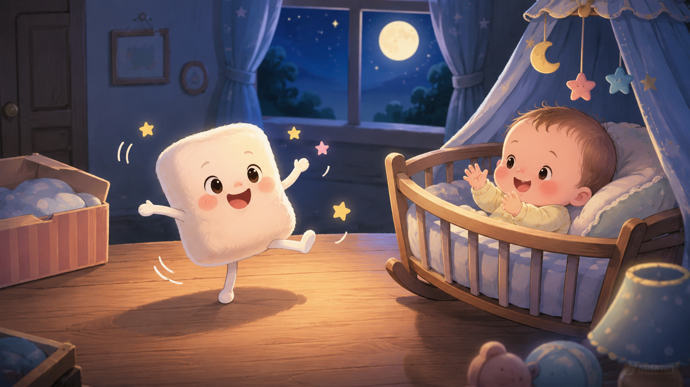

夜深了，棉花糖正躺在桌上的一个盒子里睡得正香，忽然听到“哇”地一声。

棉花糖猛地睁开眼睛，又猛地坐起来。

“谁在哭？”

借着月光它看到摇篮里的小婴儿正哭得小脸通红。

这时应该有人进来照顾它，棉花糖朝门口看去，可是没人进来。

棉花糖愣了愣，听着哭声，它忍不住了，它决定去安抚小婴儿。

摇篮在桌子的另一头，棉花糖弹跳着过去。

小婴儿看着棉花糖，突然停止哭声，目不转睛看着棉花糖弹跳过来，突然咯咯笑了起来。

棉花糖说：“原来你喜欢看我弹跳呀！我还会跳舞呢，你看！”

棉花糖极力扭动身体，虽然笨拙，但小婴儿看得很高兴，拍着小手似乎在为它鼓掌。

“好了，舞蹈表演结束，现在轮到我的绝活——变脸！”

它用小手把自己的脸捏得宽宽的，变成了大嘴蛙；接着又拉长耳朵，变成了小白兔；最后干脆把整个身体搓成了一个软乎乎的大圆饼，朝小婴儿吐了吐舌头。

小婴儿笑得前仰后合，挥舞着小拳头想要去抓它。

“好了，现在该睡觉了，我来给你唱摇篮曲。”

棉花糖跳到摇篮里，又跳到小婴儿的枕头上。

“小宝宝，快睡觉……”

棉花糖唱起来。

小婴儿打了个哈欠，带着微笑睡着了，梦里，他和棉花糖手牵手，跳起舞来。

棉花糖见他睡着了，松了口气，它也累坏了，趴在枕头上也睡着了。

当有人进来时，小婴儿睡得正香，枕头上不知什么时候多了一块棉花糖。

“奇怪，刚才好像听到哭声，这么快就睡着了，还是我听错了？”

