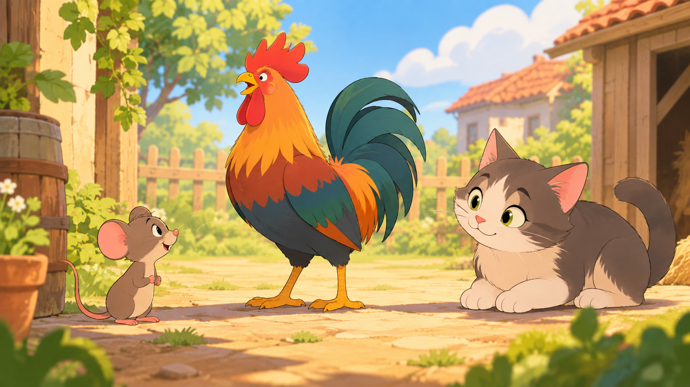

小老鼠刚学会走路，就迫不及待到外面去见见世面。

回到家时，妈妈问他都看到什么。

“妈妈，我看到一只十分可爱的动物，大家都叫他猫，他看起来很和善，还微笑跟我打招呼，让我过去，他肯定想跟我做朋友！”

老鼠妈妈听到这里心一沉：“傻孩子，你该不会过去吧？”

“没有，妈妈，都怪那只可恶的公鸡，他长得很像怪物，看起来好凶！正当我向猫走过去时，公鸡突然发出一阵怪叫：喔——喔——喔——，天哪！吓得我拔腿就跑！”

“傻孩子，你可知道，那只看起来和善的猫，是会吃掉我们的！而那只很凶的公鸡，并不会对你怎么样，记住，判断一个人，不能只看外表。”

这个故事说明：人不可貌相。
