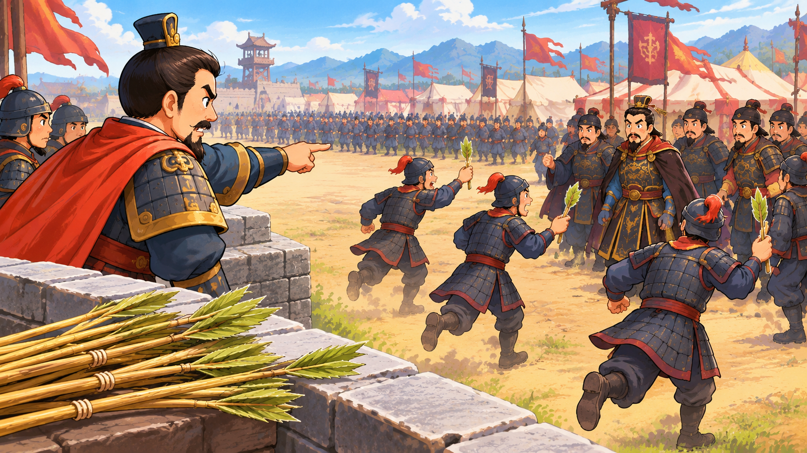

擒贼擒王是个成语，也是三十六计之一，意思是抓敌人要先抓住领头的。

故事发生在唐朝，有个叫张巡的将军，他非常聪明、勇敢。

有一次，一个叫尹子奇的叛军将领，前来攻打张巡守卫的城池。

张巡带领士兵们奋力抵抗，但尹子奇的兵力实在太强大了，眼看城池就要守不住。

大家愁眉苦脸看着张巡，问：“将军，我们现在该怎么办？”

张巡说：“这样下去我们肯定打败仗，擒贼先擒王，如果能抓住尹子奇，敌军失去指挥，就会自动土崩瓦解。”

“将军说得有道理，但怎么才能抓住尹子奇呢？他狡猾得很，又格外小心，出入都让几个人打扮得跟他一模一样，根本分不出哪个才是真正的尹子奇。”

张巡说：“我有办法。”

说着他让人把草削成箭，然后，“嗖，嗖，嗖”，射到敌营。

大家不知道他葫芦里卖什么药，但只好照做。

箭射到尹子奇军中，士兵捡到箭，拿起来一看，不禁大笑：居然用草做箭？当兵这么久都没见过！这也说明张巡没箭了，只能用草射我们，得第一时间报告给将军，这么重要的情报，肯定有奖赏！

他们争先恐后来向尹子奇报告。

没想到张巡正站在城墙上看着他们，他指着士兵们争先涌去的那个人说：“他就是真正的尹子奇！”

原来，张巡让人射出草箭的目的是为了找出真正的尹子奇，他推断士兵拿到草箭后肯定会第一时间向真正的尹子奇报告。

“贼王”找出来了，他立即命令有名的神箭手南霁云射箭。

南霁云马上弯弓搭箭，“嗖——”，箭闪电般向尹子奇射去。

尹子奇吓得嗷嗷叫，落荒而逃。

士兵们一看将军跑了，也四散而逃。

张巡用智慧击退敌人，保护了城池。