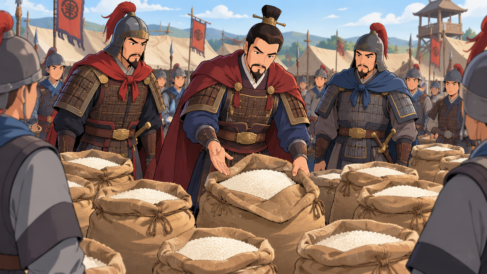

“三十六计，走为上计”是个成语，意思是处境对自己不利时，离开是聪明的好办法。

故事和古时候一位大将军有关，他叫檀道济，他武艺高强，还很聪明，有勇有谋，经常打胜仗。

在一次交战中，敌人见正面打不过檀道济，就派人绕到檀道济军队的后方，“呼”一把火，把他们的粮食全烧光了！

等灭完火，粮食已经快烧光了，没有粮食，士兵吃不饱，还怎么打仗？

“将军，我们该怎么办？”

大家无助地看着檀道济。

“事到如今，我们撤退吧！”

大家很意外，没想到这位常胜将军竟说出撤退的话。

“将军，我们一路势如破竹，现在撤退不是前功尽弃吗？而且还会被人嘲笑我们逃跑，这可有辱将军威名！”

“我们现在粮食都快没了，士兵们没饭吃，还怎么打仗？不能一时意气，更不能为了我个人的虚名，拿大家的生命开玩笑！”

说着，他就下令让士兵把石头和沙子装进装粮食的袋子，再在每个袋子上面铺上一层真正的大米。

接着，他让士兵们大声讨论说：“敌人烧了我们的粮食，就以为能打败我们，殊不知我们的粮食多得是，大家看，这一袋袋的粮食，你们想吃多少就吃多少！”

大家丈二和尚摸不着头脑，于是说：“将军，我们要跑就赶紧跑吧，还做这些干什么呀？”

“敌人烧了我们的粮食，肯定乘胜追击，现在肯定正向我们进军，我故意骗他们说我们粮食充足，他们就不敢贸然攻打我们，我们才有足够时间安全撤退。”

果然，正向檀道济而来的敌军，半路听到探子报告，立即掉头撤退了。

就这样，檀将军有勇有谋，带着士兵们安全回家了。

后来，大家就用“三十六计，走为上计”，来说明有些事情不能硬拼，要像檀将军一样，懂进退。
