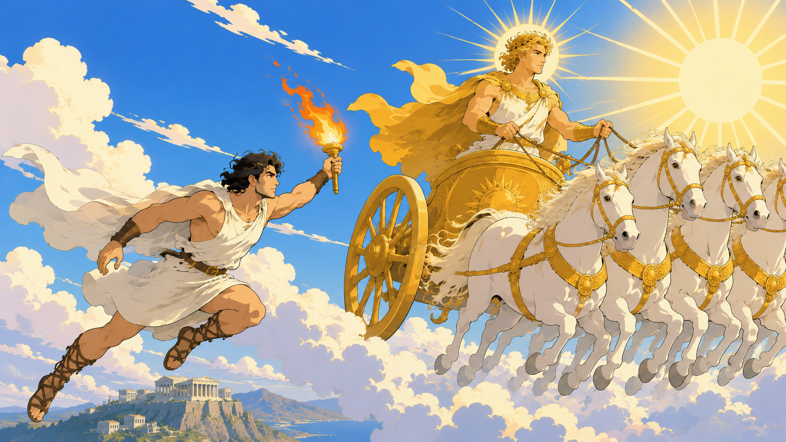

普罗米修斯用泥土创造了人类，他视人类如同自己的孩子，倾注了无限关爱。

因此当众神之王宙斯要求人类献祭时，他心疼人类，设法把肉留给他们，只献祭了骨头。

这一举让宙斯大怒，下令禁止凡间拥有火种。

普罗米修斯深知火对人类的重要性，没有火，人类将面临饥饿，黑暗和寒冷，最终灭亡。

于是他决定不顾一切为人类冒险。

他急急赶到奥林匹斯山，趁太阳神阿波罗不注意，从他的太阳车盗取了火种，又把火种藏在茴香枝中，最终把火种带到人间。

看着人们用火烹煮食物、驱赶野兽、取暖、照明，其乐融融，普罗米修斯欣慰地笑了，觉得所做的一切都是值得的。

见普罗米修斯一再违抗自己的命令，宙斯更加恼怒，他决定报复，于是用潘多拉魔盒把灾难带给凡间。

接着又命令火神赫菲斯托斯用铁链把普罗米修斯锁在高加索山悬崖，还派了一只凶狠的鹰去折磨他。

这样日服一日，普罗米修斯每天都要经历日晒雨淋，以及被鹰折磨的痛苦。

火神赫菲斯托斯看在眼里，既同情又钦佩，便对他说：“只要你愿意向宙斯认错，并把火种归还，我愿意为你担保，求他放了你。”

普罗米修斯却表示他绝不后悔。

后来，英雄赫拉克勒斯经过悬崖边，他射杀了鹰，救下普罗米修斯。

