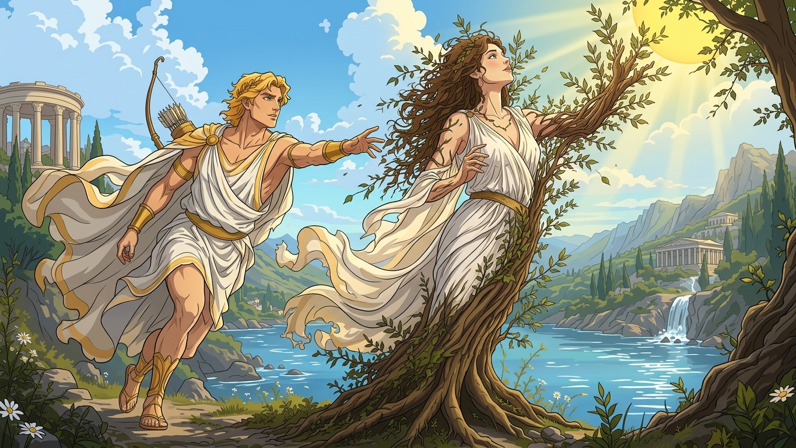

阿波罗是古希腊神话中有名的美男子。

而丘比特是神话中的爱神，他外表是个胖乎乎的小孩，总背着小弓箭在天空飞来飞去。

丘比特有两支箭：一支是金箭，被它射中的人会疯狂爱上第一个看到的人；另一支是铅箭，被它射中的人会极端厌恶爱情。

有一次，阿波罗遇到丘比特，便逗他说：“小孩，你拿着这么小的弓箭有什么用？是玩具吗？”

丘比特很不服气，心想马上让你知道我的厉害！

这时他看到女神达芙妮刚好路过，于是有了主意。

他飞到空中，向阿波罗射出金箭。

又向达芙妮射出铅箭。

被金箭射中的阿波罗看到达芙妮，立即对她一见钟情，深深爱上了她。

他马上上前向达芙妮表达爱意。

但达芙妮这时中了铅箭，非常厌恶爱情，尽管阿波罗是美男子，她也没办法喜欢他。

于是她想都没想就拒绝了阿波罗。

但阿波罗仍然热切地表达爱意。

最后达芙妮忍无可忍，拔腿就跑，阿波罗在后面紧紧追赶。

眼看阿波罗就要追上，这时达芙妮刚好跑到她父亲河神佩涅俄斯的河边，她向父亲祈求道：“随便把我变成其他什么的吧，树木花草都可以，只要不让阿波罗喜欢我就行！”

父亲问道：“你确定吗？”

达芙妮坚定地点了点头。

瞬间，达芙妮便变成一棵月桂树。

这时阿波罗也追上来了，但不见美丽的达芙妮，只看到一棵树。

阿波罗伤心地说：“既然你不能成为我的妻子，那就成为我永远的圣树。”

阿波罗用月桂树枝做装饰。古希腊人后来还用月桂枝编成桂冠，赠给诗人、英雄和胜利者。

