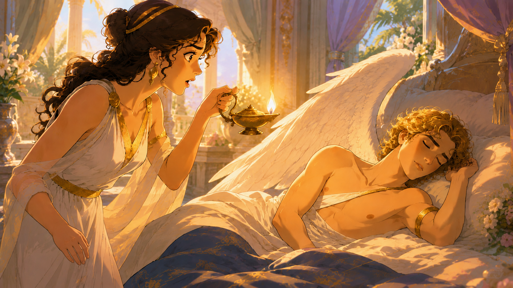

丘比特是西方神话中的爱神，他俊美无比，是美神维纳斯的儿子。

而普赛克是凡人，她是一位公主，她美貌无双，人人都夸她是“小维纳斯”。

真正的美神维纳斯听了很不高兴，觉得凡人怎能和她相提并论，于是让儿子丘比特去惩罚她。

但当丘比特看到普赛克时，立即被她的美貌惊呆了，以致于一不小心被自己的金箭划伤。

这下他更深深爱上普赛克，原来被丘比特的金箭射中，就会爱上第一个看到的人。

丘比特托西风之神帮忙，西风之神一阵风把普赛克带到丘比特的宫殿。

丘比特怕被普赛克认出来，天黑了才来和普赛克见面，并对她说：“答应我，任何时候都不要偷看我的容貌。”

普赛克答应了。

有一天，普赛克的两位姐姐来看她，发现她住在比王宫还奢华的宫殿，忍不住嫉妒，于是挑拨说：“你那个丈夫不肯露脸，肯定是丑陋无比的怪物！毕竟神谕一早就有提示，你的丈夫是个怪物，说不定有一天会杀了你！”

普赛克听了又疑惑又害怕，忍不住想看清楚这个“丈夫”究竟是不是怪物。

于是有一天，她趁丘比特熟睡，举着油灯，靠近丈夫。

当灯光照到丈夫的脸庞时，普赛克惊呆了：原来丈夫不但不是怪物，还是个俊美无比的少年，她认出来正是爱神丘比特。

她一激动，手一抖，灯油滴在丘比特的脸上。

丘比特一下就被烫醒了。

他一下明白过来怎么回事。

他失望又悲伤地说：“没有信任，就没有爱。”

这句话后来便成为名言。

说完丘比特便离去了，宫殿也随之消失。

普赛克后悔极了，她到处寻找丘比特，最后她找到维纳斯，求她帮她找到丘比特。

维纳斯更加气愤：“好啊，你一个凡人，不但觊觎我美神的地位，竟然还想嫁给我儿子！”

她想了想，便刁难说：“如果你能完成四件事，我就让你见丘比特！”

她心想这四件事都不是凡人能办到的，也让她认清自己的身份，自觉离开儿子。

但普赛克在其他人的帮助下，克服了困难，顺利完成任务。

当她完成最后一件任务：取回一盒“美貌”，欢天喜地去见维纳斯时，她又想：这一盒美貌真的能让人更美丽吗？如果我也得到一些，说不定丘比特见到我时能原谅我，说不定更喜欢我。

想到这里，她打开了盒子。

但哪有什么美貌？盒子里装的是永久的沉睡，普赛克立即倒下昏睡过去。

幸亏这时丘比特赶到，他用神力让普赛克苏醒。

然后他又去求宙斯帮忙。

宙斯被他们的爱情感动，赐予普赛克一杯神酒。

普赛克喝下后，获得永生，成为灵魂女神，并和丘比特结了婚。

丘比特和普赛克的爱情，象征爱与灵魂。