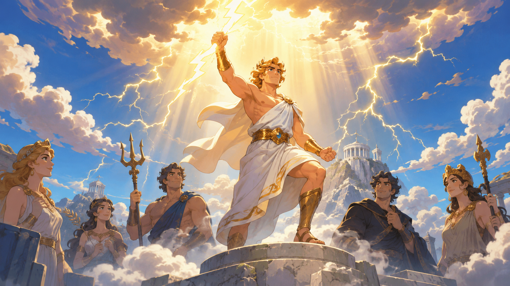

宙斯古希腊神话中级别最高的神，掌管闪电和雷霆，他是怎么成为众神之王的呢？

原来他的父亲叫克洛诺斯，是原本的神王。

有一天，他听到一个预言：他的孩子中的一个，将夺去他的王位，取代他神王的位置。

克洛诺斯相当担心。于是，当他的孩子一出生，他就把孩子放进肚子里藏起来。

宙斯是第六个孩子，当他快降生时，妈妈瑞亚再也受不下了。

她下定决心再也不让丈夫这么做，于是生下小宙斯后，她就把他送到一个隐秘的深山溶洞里，一位善良的仙女和小羊照顾他成长。

瑞亚又把一块大石头用布包起来，交给丈夫克洛诺斯说：“这是你的第六个孩子宙斯。”

克洛诺斯信以为真，同样放进肚子藏起来，殊不知是块石头。

宙斯渐渐长大，他力量惊人，而且非常聪明。

当他知道哥哥姐姐们的遭遇后，决定把大家救出来！

于是他化装成一名侍从，悄悄混进王宫，给克洛诺斯喝下了一杯特别的药水。

“呕——”克洛诺斯肚子一阵剧烈翻滚，先把当年吞下的那块大石头吐了出来，接着把宙斯的哥哥姐姐们一个个吐了出来。

幸运的是，因为他们是神，大家在肚子肚里都完好无损！

为了打败强大的克洛诺斯，宙斯还解救了被关押的“独眼巨人”和“百臂巨人”。

独眼巨人们为了感谢宙斯，帮他打造了一件无敌的神兵——能发射闪电的“雷霆”。

在一场天昏地暗的大战后，宙斯挥舞着雷霆，带领哥哥姐姐们彻底打败了克洛诺斯。

从此,宙斯掌管天空和雷电,成为了希腊神话里最高级别的神。
